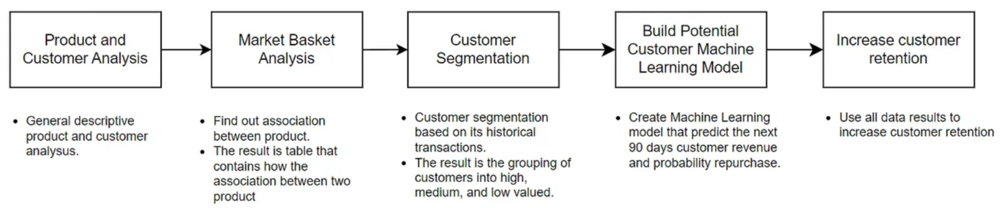

# Description
The objective of this problem is described in the following points:
1. Customer Segmentation: Apply RFM analysis to divide customers into segments based on their buying habits, aiming to personalize marketing to each group.
2. Identifying Key Customers: Focus on customers with the best recent, frequent, and high-value purchases to strengthen loyalty.
3. Boosting Retention: Use RFM insights for strategies that increase loyalty and reduce churn, keeping customers engaged longer.
4. Create customer potential analysis for next 90 days transaction.
5. Conduct Market Basket Analysis to get insight about association between items.
 
## About data
 The dataset that we will use is transaction online retail from the UCI Machine Learning Repository, which can be accessed from the [link](http://archive.ics.uci.edu/dataset/352/online+retail).

 ## Dashboard Analytics
 Tableau: [Link](https://lookerstudio.google.com/s/ochJ3GR47OA)

## Result

What we can do from this strategy :
- We apply product and customer analysis. This is general descriptive analysis to deepen our understanding of customers by conducting thorough product analysis alongside analyzing customer retention through cohort studies.
- We segment customers based on transaction history. The purpose of customer segmentation is to categorize customers into high, medium, and low value. So that we can apply different approaches to maintain customer retention.
- We generate prediction model machine learning that can help us to predict which customers are likely to repurchase involves using historical data to forecast future buying behavior. This model can help us to identify which customers potentially churn and prevent them. Conversely, for customers who do not have the potential, we can take other approaches that can increase satisfaction.
- We apply market basket analysis. Market basket analysis (MBA) is a data mining technique used to uncover patterns in transaction data. It identifies items frequently purchased together and can help businesses understand customer purchasing behavior.

The insight from this method:
1. We can design marketing campaigns for different segments, based on the customer class, to keep them engaged.
2. We can develop new products based on the insights from different segments to better meet the needs of each group.
3. From customers with low probability of repurchase, we can do a more detailed analysis of their experience so we can figure out and fix the cause.
4. We assume this model works well enough so that we can see customers with a high repurchase probability but do not repurchase. We can take mitigation actions to prevent churn customers.
5. We can see high-value customers, based on our customer segmentation, but do not repurchase or have low repurchase probability. We can try to attract them back because they are our big spenders after all.
6. We can see medium-value customers, based on our customer segmentation, but do not repurchase or low repurchase probability. They are our loyal customers, so we need to take incentive actions to prevent losing our loyal customers.
